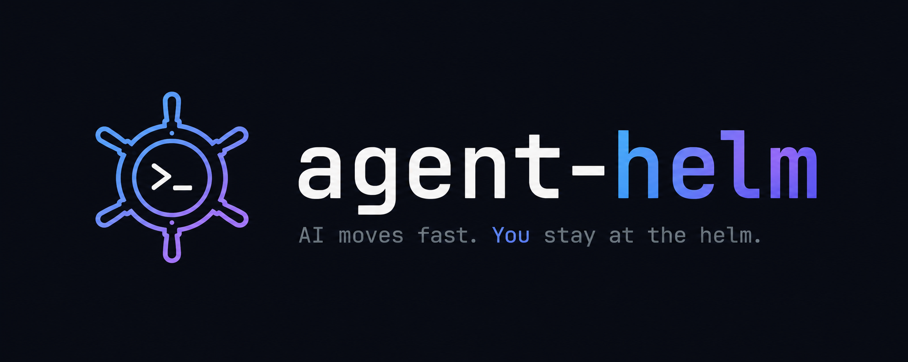
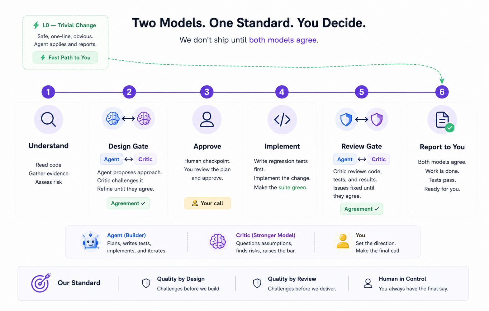

<p align="center">
  
</p>

<p align="center">
  <a href="LICENSE"></a>
  
  
</p>

**One prompt in. Two models argue it out. One clean, reviewed result back — and
the final call is always yours.**

## The problem

AI coding agents write faster than you can stay informed. So you slowly drift
out of your own project:

- The agent asks *"option A or B?"* — you answer *"you know best"*, because you
  lost the thread three walls of text ago.
- A feature ships. It works. And you realize **you can no longer explain your
  own codebase.**
- A "bug fix" turns out to be a loosened test.

That's not a coding problem, it's a **control** problem. agent-helm fixes the
control loop, not the model.

## The idea: two models, one standard, you decide

In most setups, one model plans the work, writes the code, reviews its own
code, and grades its own homework. agent-helm splits the roles:

| Role | Who | Job |
|------|-----|-----|
| **Builder** | mid-tier model | plans, writes tests, implements, iterates |
| **Critic** | strongest model available | challenges the design, reviews the result, raises the bar |
| **You** | the engineer | set the direction, approve the plan, make the final call |

Work passes through **two gates**:

1. **Design Gate** — before any code, the builder proposes an approach and the
   critic challenges it. They iterate **until they agree**, then you get a
   3-line plan to approve.
2. **Review Gate** — after implementation, the critic reviews the code, the
   tests, and the results. Issues are fixed **until both models sign off**.

Nothing reaches you until both models agree — so what does reach you is short:
one plan to approve, one result to accept. Disagreements are settled between
the models, off your screen; a disagreement they *can't* settle comes to you
as one sharp question, never silently swallowed.

<p align="center">
  
</p>

Trivial changes (a rename, a typo) skip the gates entirely — ceremony is
proportional to risk. And with an agent that has no second model (plain
Codex), the critic's gates become *your* plan approval: the loop holds, the
reviewer is you.

## What you see in chat

Instead of a 2,000-word essay:

```
Problem:  Order cancellation has a race condition under concurrent requests.
Plan:     Make the state transition atomic; add a regression test that
          reproduces the race first.
Risk:     L2 — touches concurrency. Waiting for your go-ahead.
Question: None.
```

You answer in one line. When it's done — and only after both models agree:

```
Done:     Race fixed at the state-transition level.
Verified: New regression test fails on old code, passes now; full suite green.
Recorded: docs/agent-journal/2026-08-18-bug-order-cancel-race.md
```

## Risk decides the process

| Level | Example | What happens |
|-------|---------|--------------|
| **L0** | rename, typo | Just does it. One line back. |
| **L1** | local feature, ordinary bug | Short plan → build with tests → Review Gate → report |
| **L2** | refactor, concurrency, persistence | Design Gate + safety tests **before** any change → your approval |
| **L3** | auth, money, migrations, breaking APIs | Your explicit sign-off **before any code** |

Migrations, auth, payments, public APIs escalate **automatically** — the agent
doesn't get to decide that part. When in doubt, it must go up a level.

## Evidence, not vibes

- No code based on guesses — claims are proven by running, testing, or reading
  source, down to the **dependency's source** when the docs are wrong.
- Bugs are **reproduced first** and get a failing regression test before the fix.
- Refactors start with a test safety net pinning current behavior.
- Tests are never weakened to get to green.
- Anything unproven is labeled `Assumption: ...` — never smuggled in as fact.

## Your project remembers

Every finished task leaves a half-page record — what was asked, the plan, what
was done, how it was verified:

```
docs/
├── agent-journal/
│   ├── 2026-08-16-refactor-payment-service.md
│   └── 2026-08-18-bug-order-cancel-race.md
└── briefs/
    └── invoice-export-api.md   ← hand this to your mobile/frontend teammate
```

Six months later, *"why does this work this way?"* is a thirty-second read —
for you **and** for the agent's next session. When an API contract changes,
the agent also writes an **integration brief** the other team can implement
from without reading your code.

## Install

Works with **Claude Code**, **OpenAI Codex**, and anything that reads the open
[AGENTS.md](https://agents.md) standard (Cursor, Copilot, ...). Same files, no
duplication.

**Option A — one command, inside your project** *(recommended)*

```bash
curl -fsSL https://raw.githubusercontent.com/suleymanbyzt/agent-helm/master/install.sh | bash
```

```powershell
irm https://raw.githubusercontent.com/suleymanbyzt/agent-helm/master/install.ps1 | iex
```

**Option B — clone first, look around, then install**

```bash
git clone https://github.com/suleymanbyzt/agent-helm
./agent-helm/install.sh /path/to/your-project
```

**Option C — global: just you, all your projects**

```bash
curl -fsSL https://raw.githubusercontent.com/suleymanbyzt/agent-helm/master/install.sh | bash -s -- --global
```

Option A/B drop these into your project (commit them — the rules then apply to
every teammate's agent):

```
your-project/
├── AGENTS.md              ← the engineering constitution (~150 lines, that's all)
├── CLAUDE.md              ← @AGENTS.md + the advisor loop
├── .agents/skills/        ← for Codex
├── .claude/skills/        ← for Claude Code
├── templates/             ← journal + brief + decision formats
└── docs/
    ├── agent-journal/     ← your project's memory starts here
    ├── briefs/            ← integration briefs for other teams
    └── decisions/         ← architectural decisions + rejected alternatives
```

Option C adds the same rules to `~/.claude/CLAUDE.md` and `~/.codex/AGENTS.md`
inside clearly marked blocks — your personal rules stay untouched.

**Uninstall** — removes everything agent-helm installed, except your journal
entries (they're your project's history) and any file you modified:

```bash
./install.sh --uninstall            # from a project
./install.sh --global --uninstall   # global
```

### Recommended setup (Claude Code) — max output, min tokens

Two minutes, three settings:

1. **`/model`** → pick a **mid-tier model as the builder** (current
   recommendation: Sonnet). It does the typing — routine implementation
   doesn't need flagship prices.
2. **`/advisor`** → set the **strongest model as the critic** (current
   recommendation: Fable). It's only called at the two gates — design and
   review — where judgment actually matters.
3. **Cap the context window** (e.g. ~500K even if 1M is offered). Very long
   contexts lose the thread and hallucinate more; history belongs in
   `docs/agent-journal/`, not in the window.

Why this combo works: you pay flagship prices only for the few thousand
tokens of judgment, not for every line of code — while every result still
ships critic-approved. Fast to run, cheap to iterate, and mistakes get
caught between the models before they ever reach you.

*(Model names are today's recommendation, not a requirement — when newer
models ship, the principle stays: mid-tier builder + strongest critic.)*

## The skills

| Skill | What it enforces |
|-------|------------------|
| `feature-development` | Understand → plan → your approval → build with tests → record |
| `bug-fix` | Reproduce first → root cause, not symptom → regression test → fix |
| `safe-refactor` | Safety net **before** touching code → small steps → prove behavior preserved |
| `performance-investigation` | Measure → prove the bottleneck → fix → measure again. No guess-optimization |
| `code-review` | Risk-ordered reading, evidence-backed findings, triage — no "LGTM" on skimmed diffs |
| `dependency-upgrade` | Release notes read → breaking changes mapped to call sites → green suite proves it. "It compiles" ≠ "it works" |
| `verify-work` | Never says "done" without having watched it work |
| `integration-brief` | API changed? The other team gets a brief, not a code tour |
| `record-decision` | Real architectural choice? The decision, the reasons, and the rejected alternatives get written down |

## What agent-helm is not

- **Not a methodology cult.** No forced TDD everywhere, no spec documents for
  a one-line fix. Effort scales with risk.
- **Not a magic leash.** Its guarantee is *visibility*: risk declared where
  you can veto it, decisions written where you can read them, claims backed
  by evidence you can check. And a second model paid to disagree.
- **Not vendor-locked.** Plain markdown on open standards
  ([AGENTS.md](https://agents.md), [Agent Skills](https://agentskills.io)).
  No model names hardcoded — when better models ship, the rules don't change.

## Philosophy

> AI can write the code.
> **The engineer stays in control of the system.**

Minimum accidental complexity — not minimum code.
Architecture proportional to risk.
The human is the last link in the chain.

## License

MIT
