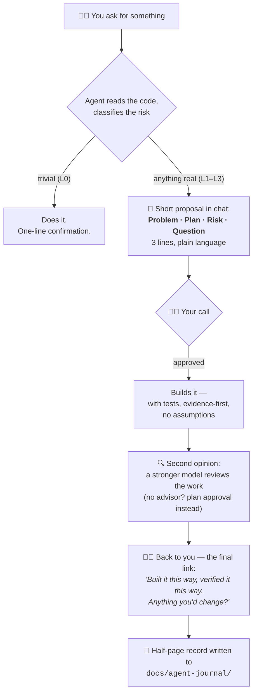

# agent-helm

> **You ask. The agent proposes — in three short lines. You decide. It builds,
> verifies, records. You stay at the helm.**

## Sound familiar?

- The agent asks *"should I go with option A or B?"* — and you answer
  *"you know best"*, because you lost the thread three walls of text ago.
- A feature gets built. It works. And you realize **you can no longer explain
  your own codebase.**
- The agent "fixes" a bug by loosening the test that caught it.
- You come back the next day and neither you nor the agent remembers why
  yesterday's decision was made.

That's not a coding problem. It's a **control** problem: the AI writes faster
than you can stay informed, so you slowly drift out of your own project —
until your only remaining job is typing *"ok, go ahead."*

**agent-helm keeps you in the loop without drowning you in it.**

## How it works



Two rules make this work:

1. **Chat is the control plane.** Short, decision-ready messages only.
   Details live in files, not in your face.
2. **You are the last link in the chain.** Nothing risky starts without your
   word, and nothing counts as done until you've seen it.

## What chat looks like

Instead of a 2,000-word essay, you get this:

```
Problem:  Order cancellation has a race condition under concurrent requests.
Plan:     Make the state transition atomic; add a regression test that
          reproduces the race first.
Risk:     L2 — touches concurrency. Waiting for your go-ahead.
Question: None.
```

You reply in one line. It gets to work. When it's done:

```
Done:     Race fixed at the state-transition level.
Verified: New regression test fails on old code, passes now; full suite green.
Recorded: docs/agent-journal/2026-08-18-bug-order-cancel-race.md
```

## Your project remembers

Every finished task leaves a **half-page record** — what was asked, the plan,
what was done, how it was verified:

```
docs/
├── agent-journal/
│   ├── 2026-08-14-feature-invoice-export.md
│   ├── 2026-08-16-refactor-payment-service.md
│   └── 2026-08-18-bug-order-cancel-race.md
└── briefs/
    └── invoice-export-api.md   ← hand this to your mobile/frontend teammate
```

Six months later, *"why does this work this way?"* has an answer you can read
in thirty seconds — and so can the agent's next session. When an API changes,
the agent also writes an **integration brief** the person on the other side
can implement from directly, without reading your code.

## Effort proportional to risk

No ceremony for a typo. No cowboy coding on a migration.

| Level | Example | What happens |
|-------|---------|--------------|
| **L0** | rename, typo | Just does it |
| **L1** | local feature, ordinary bug | Short plan → proceeds → tests → journal |
| **L2** | refactor, concurrency, persistence | Safety tests **before** any change → your approval |
| **L3** | auth, money, migrations, breaking APIs | Your explicit sign-off **before any code** |

Touching migrations, auth, payments, or a public API escalates
**automatically** — the agent doesn't get to decide that part.

## Evidence, not vibes

- No code based on guesses. Claims are proven: run it, test it, read the
  source — down to the **dependency's source code** when the docs are wrong.
- Refactors start with a test safety net that pins current behavior **before**
  a single line moves.
- Bugs get reproduced and get a failing regression test **before** the fix.
- Tests are never weakened to get to green.
- Whatever remains unproven is labeled: `Assumption: ...` — never smuggled in
  as fact.

## Install

Works with **Claude Code**, **OpenAI Codex**, and anything that reads the open
`AGENTS.md` standard (Cursor, Copilot, ...). Same files, no duplication.

```bash
git clone https://github.com/<you>/agent-helm
cd your-project
/path/to/agent-helm/install.sh
```

Windows:

```powershell
\path\to\agent-helm\install.ps1 -Target .
```

You get:

```
your-project/
├── AGENTS.md              ← the engineering constitution (~130 lines, that's all)
├── CLAUDE.md              ← one line: @AGENTS.md
├── .agents/skills/        ← for Codex
├── .claude/skills/        ← for Claude Code
├── templates/             ← journal + brief formats
└── docs/agent-journal/    ← your project's memory starts here
```

Commit the files — the same rules then apply to every teammate's agent.

## The skills

| Skill | What it enforces |
|-------|------------------|
| `feature-development` | Understand → short plan → your approval → build with tests → record |
| `bug-fix` | Reproduce first → root cause, not symptom → regression test → fix |
| `safe-refactor` | Safety net **before** touching code → small steps → prove behavior preserved |
| `verify-work` | Never says "done" without having watched it work |
| `integration-brief` | API changed? The other team gets a brief, not a code tour |

## What agent-helm is not

- **Not a methodology cult.** No forced TDD everywhere, no spec documents for
  a one-line fix. Effort scales with risk.
- **Not a magic leash.** Its guarantee is *visibility*: risk declared in chat
  where you can veto it, decisions written where you can read them, claims
  backed by evidence you can check.
- **Not vendor-locked.** Plain markdown on open standards
  ([AGENTS.md](https://agents.md), [Agent Skills](https://agentskills.io)).
  No model names hardcoded — when better models ship, the rules don't change.

## Philosophy

> AI can write the code.
> **The engineer stays in control of the system.**

Minimum accidental complexity — not minimum code.
Architecture proportional to risk.
The human is the last link in the chain.

## License

MIT
